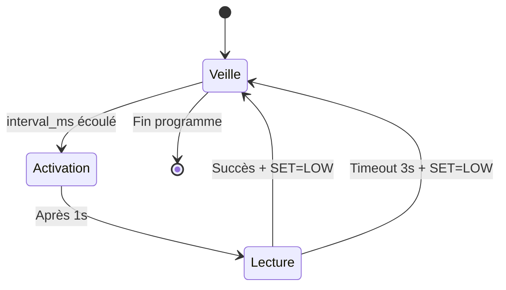
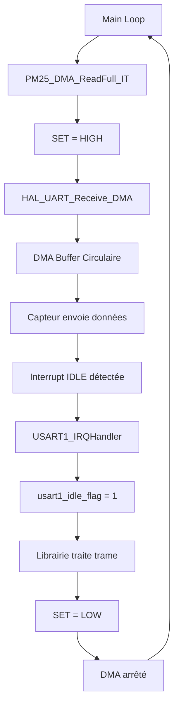
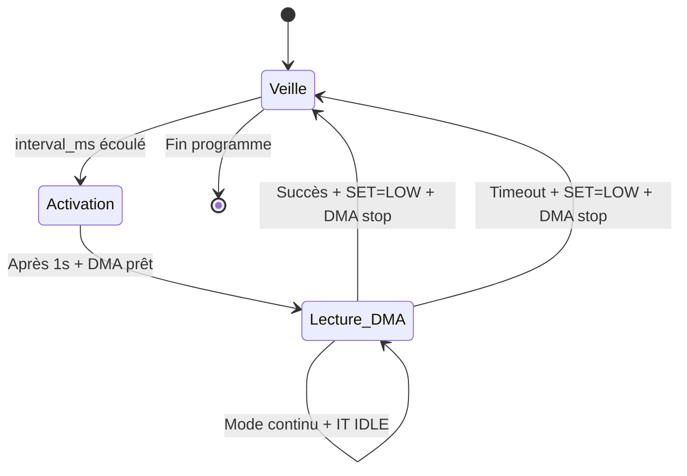
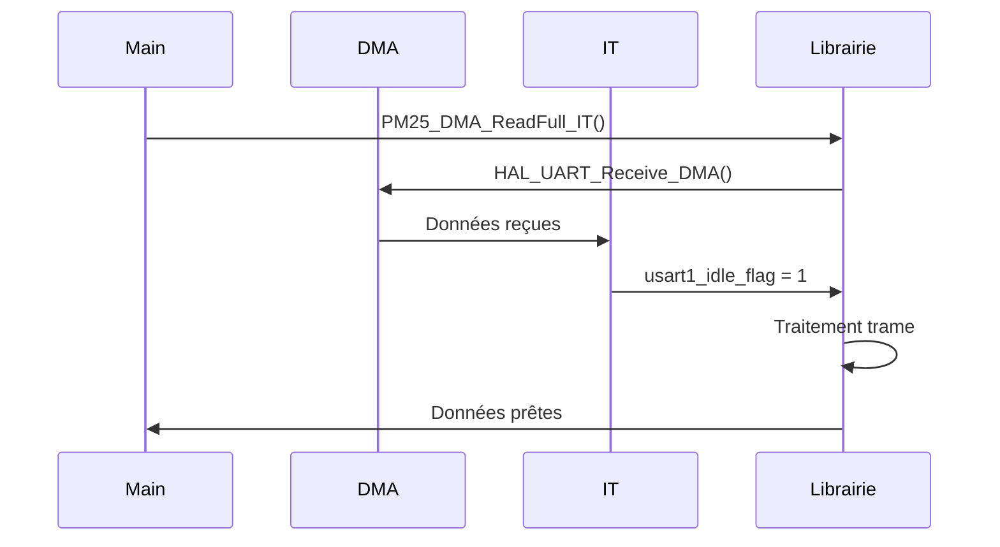

# STM32_MP25 - Librairie Capteur PM2.5 SEN0177

[](https://opensource.org/licenses/MIT)
[](https://www.st.com/en/microcontrollers-microprocessors/stm32l4-series.html)

Librairie optimisée pour capteur de particules fines PM2.5 SEN0177 (DFRobot) sur microcontrôleurs STM32 avec HAL.

## 📋 Table des matières

- [Vue d'ensemble](#vue-densemble)
- [Caractéristiques](#caractéristiques)
- [Installation](#installation)
- [Configuration](#configuration)
- [API Reference](#api-reference)
- [Exemples d'utilisation](#exemples-dutilisation)
- [Architecture](#architecture)
- [Optimisations](#optimisations)
- [Dépannage](#dépannage)

## 🎯 Vue d'ensemble

Cette librairie fournit une interface complète et optimisée pour le capteur PM2.5 SEN0177 de DFRobot. Elle supporte plusieurs modes de fonctionnement :

- **Mode Polling** : Lecture périodique avec gestion d'état optimisée
- **Mode DMA + Interruptions** : Lecture continue haute performance
- **Mode Continu** : Surveillance en temps réel

### Données mesurées

Le capteur fournit les mesures suivantes :

- **PM1.0, PM2.5, PM10** (standard et atmosphérique)
- **Particules par taille** : 0.3µm, 0.5µm, 1.0µm, 2.5µm, 5.0µm, 10µm
- **Version firmware** et **checksum**

## ✨ Caractéristiques

### 🔧 Fonctionnalités principales

- ✅ **2 modes de lecture** : Polling et DMA
- ✅ **Gestion d'énergie** : Activation/désactivation automatique
- ✅ **Validation robuste** : Header et checksum
- ✅ **Interprétation qualité air** : Codes couleur et labels
- ✅ **Mode debug** configurable
- ✅ **Buffer circulaire** optimisé
- ✅ **Gestion timeout** avancée

### 📊 Interprétation qualité air

- **6 niveaux** de qualité (Très bon → Très mauvais)
- **Emojis et couleurs** pour interface utilisateur
- **Seuils OMS** respectés
- **Ratio PM2.5/PM10** avec interprétation

### ⚡ Optimisations

- **CPU efficient** : États finis pour économie d'énergie
- **Mémoire optimisée** : Buffer circulaire statique
- **UART haute vitesse** : 9600 bauds
- **DMA circulaire** pour mode continu

## 📦 Installation

### Structure des fichiers

```
Drivers/STM32_MP25/
├── STM32_MP25.h          # Déclarations et structures
├── STM32_MP25.c          # Implémentation
└── README.md            # Documentation
```

### Configuration STM32CubeIDE

1. **Ajouter les fichiers** dans votre projet :

   ```
   Drivers/STM32_MP25/STM32_MP25.h
   Drivers/STM32_MP25/STM32_MP25.c
   ```

2. **Configurer l'UART** :

   - UART1 à 9600 bauds
   - 8 bits, pas de parité, 1 stop bit
   - Mode TX/RX

3. **Configurer le GPIO** :

   - Pin SET (PA8 par défaut)
   - Mode Output Push-Pull

4. **Configurer le DMA** (pour mode continu) :
   - Canal DMA1_Channel5 pour UART1_RX
   - Mode circulaire
   - Interruptions activées

## ⚙️ Configuration

### Initialisation de base

```c
#include "STM32_MP25.h"

// Configuration minimale
PM25_SetDebugMode(0);                    // Debug désactivé
PM25_SetControlPin(GPIOA, GPIO_PIN_8);   // Pin SET = PA8
PM25_Init(&huart1);                      // UART configuré
```

### Configuration avancée

```c
// Configuration complète avec callbacks
PM25_SetDebugMode(1);                    // Debug activé
PM25_SetControlPin(GPIOA, GPIO_PIN_8);   // Pin de contrôle
PM25_Init(&huart1);                      // Initialisation

// Fonctions futures (réservées pour extensions)
PM25_SetFilterThreshold(5);              // Filtrage doublons (futur)
PM25_SetUserCallback(my_callback);       // Callback personnalisé (futur)
```

**Explication :**

- `PM25_SetDebugMode(1)` : Active les messages de debug de la librairie
- `PM25_SetControlPin()` : Définit la pin GPIO pour contrôler le capteur
- `PM25_Init()` : Configure l'UART pour communiquer avec le capteur
- **Note** : Certaines fonctions avancées sont réservées pour de futures extensions

```

**Explication :**

- `PM25_SetFilterThreshold(5)` : Filtre les doublons de données (optionnel)
- `PM25_SetUserCallback()` : Callback personnalisé pour traitement avancé (optionnel)
```

## 📚 API Reference

### Structures de données

#### PM25_FullData

```c
typedef struct {
    uint8_t  raw_frame[32];           // Trame brute reçue
    uint16_t pm1_0_standard;          // PM1.0 standard
    uint16_t pm2_5_standard;          // PM2.5 standard
    uint16_t pm10_standard;           // PM10 standard
    uint16_t pm1_0_atmospheric;       // PM1.0 atmosphérique
    uint16_t pm2_5_atmospheric;       // PM2.5 atmosphérique
    uint16_t pm10_atmospheric;        // PM10 atmosphérique
    uint16_t particles_0_3um;         // Particules >0.3µm
    uint16_t particles_0_5um;         // Particules >0.5µm
    uint16_t particles_1_0um;         // Particules >1.0µm
    uint16_t particles_2_5um;         // Particules >2.5µm
    uint16_t particles_5_0um;         // Particules >5.0µm
    uint16_t particles_10um;          // Particules >10µm
    uint8_t  version;                 // Version firmware
    uint16_t checksum;                // Checksum calculé
} PM25_FullData;
```

#### PM_StatusInfo

```c
typedef struct {
    int         index;                // Code numérique
    const char* emoji;                // Emoji représentatif
    const char* label;                // Label textuel
    const char* description;          // Description détaillée
} PM_StatusInfo;
```

### Fonctions principales

#### Configuration

```c
void PM25_SetDebugMode(int enable);
void PM25_SetControlPin(GPIO_TypeDef *port, uint16_t pin);
void PM25_Init(UART_HandleTypeDef *huart);
```

#### Lecture de données

```c
// Mode polling continu ou périodique
int PM25_Polling_ReadFull(UART_HandleTypeDef *huart,
                         PM25_FullData *data,
                         uint32_t interval_ms);

// Mode DMA IT continu ou périodique
int PM25_DMA_ReadFull_IT(UART_HandleTypeDef *huart,
                        PM25_FullData *data,
                        uint32_t interval_ms);
```

#### Validation

```c
int PM25_Validate_Checksum(const uint8_t *frame);
```

#### Interprétation qualité air

```c
int PM25_Quality_GetCode(uint16_t pm, const char *type);
PM_StatusInfo PM25_Quality_InterpretCode(int code);

int PM25_Ratio_GetCode(uint16_t pm25, uint16_t pm10);
PM_StatusInfo PM25_Ratio_Interpret(int code);
```

### Codes de retour

| Valeur | Signification                   |
| ------ | ------------------------------- |
| `1`    | Succès - Données valides reçues |
| `0`    | Échec - Timeout ou erreur       |
| `-1`   | En cours - Attente de données   |

## 💡 Programme d'exemples

### Mode Polling

Le mode polling utilise une approche synchrone avec gestion d'état optimisée pour économiser l'énergie du microcontrôleur.

#### 1. Includes

```c
/* USER CODE BEGIN Includes */
#include <stdio.h>
#include "STM32_MP25.h"
/* USER CODE END Includes */
```

**Explication :**

- `stdio.h` : Pour utiliser `printf()` et afficher des messages de debug
- `STM32_MP25.h` : Interface de la librairie PM2.5 (structures, fonctions, constantes)

#### 2. Fonction utilisateur

```c
/* USER CODE BEGIN 0 */
int __io_putchar(int ch)
{
  HAL_UART_Transmit(&huart2, (uint8_t *)&ch, 1, HAL_MAX_DELAY);
  return ch;
}

void display_pm25_data(PM25_FullData *donnees)
{
  // Affichage trame brute directement depuis la structure
  printf("\n=== Trame reçue (32 octets) ===\n");
  for (int i = 0; i < PM25_FRAME_LEN; i++) // PM25_FRAME_LEN = 32
  {
    printf("%02X ", donnees->raw_frame[i]); // Affichage de chaque octet en hexadécimal
  }
  printf("\n");

  // Vérification du checksum
  if (PM25_Validate_Checksum(donnees->raw_frame))
  {
    printf("✅ Checksum valide (0x%04X)\n", donnees->checksum);
  }
  else
  {
    printf("❌ Checksum invalide (0x%04X)\n", donnees->checksum);
  }

  // Données brutes sans interprétation
  printf("\n=== Données brutes ===\n");
  printf("PM1.0 std:%d atm:%d | PM2.5 std:%d atm:%d | PM10 std:%d atm:%d\n",
         donnees->pm1_0_standard, donnees->pm1_0_atmospheric,
         donnees->pm2_5_standard, donnees->pm2_5_atmospheric,
         donnees->pm10_standard, donnees->pm10_atmospheric);
  printf("Particules: 0.3µm:%d 0.5µm:%d 1.0µm:%d 2.5µm:%d 5.0µm:%d 10µm:%d\n",
         donnees->particles_0_3um, donnees->particles_0_5um, donnees->particles_1_0um,
         donnees->particles_2_5um, donnees->particles_5_0um, donnees->particles_10um);
  printf("Version:%d Checksum:0x%04X\n", donnees->version, donnees->checksum);

  // Interprétation qualité PM1.0, PM2.5, PM10 (standard) et ratio
  printf("\n=== Interprétation qualité air ===\n");
  // Récupération des codes d'interprétation
  int code_pm1 = PM25_Quality_GetCode(donnees->pm1_0_standard, "PM1.0");
  int code_pm25 = PM25_Quality_GetCode(donnees->pm2_5_standard, "PM2.5");
  int code_pm10 = PM25_Quality_GetCode(donnees->pm10_standard, "PM10");
  int code_ratio = PM25_Ratio_GetCode(donnees->pm2_5_standard, donnees->pm10_standard);

  // Interprétation des codes
  PM_StatusInfo info_pm1 = PM25_Quality_InterpretCode(code_pm1);
  PM_StatusInfo info_pm25 = PM25_Quality_InterpretCode(code_pm25);
  PM_StatusInfo info_pm10 = PM25_Quality_InterpretCode(code_pm10);
  PM_StatusInfo info_ratio = PM25_Ratio_Interpret(code_ratio);

  // Affichage qualité air et ratio PM
  printf("Qualité PM1.0 : %d µg/m³ -> %s %s (%s)\n", donnees->pm1_0_standard, info_pm1.emoji, info_pm1.label, info_pm1.description);
  printf("Qualité PM2.5 : %d µg/m³ -> %s %s (%s)\n", donnees->pm2_5_standard, info_pm25.emoji, info_pm25.label, info_pm25.description);
  printf("Qualité PM10  : %d µg/m³ -> %s %s (%s)\n", donnees->pm10_standard, info_pm10.emoji, info_pm10.label, info_pm10.description);

  float ratio = donnees->pm10_standard > 0 ? (float)donnees->pm2_5_standard / donnees->pm10_standard : 0.0f;
  printf("\nRatio PM2.5/PM10 : %.2f -> %s %s (%s)\n", ratio, info_ratio.emoji, info_ratio.label, info_ratio.description);
}
/* USER CODE END 0 */
```

**Explication :**

- `__io_putchar()` : Redirige `printf()` vers UART2 pour le debug
- `display_pm25_data()` : Affiche les données du capteur (brutes + interprétées)

#### 2. Initialisation

```c
/* USER CODE BEGIN 2 */
HAL_Delay(1000);
printf("====================================================\n");
printf("========= DEMO SEN0177 PM2.5 mode polling ==========\n");
printf("====================================================\n\n");
PM25_SetDebugMode(1); // Activation du mode debug
// Initialisation du capteur avec la librairie
printf("Initialisation du capteur...\n");
PM25_Init(&huart1);                    // Initialisation du capteur
PM25_SetControlPin(GPIOA, GPIO_PIN_8); // Configuration de la pin SET
printf("✅ Capteur initialisé\n");
printf("====================================================\n");
/* USER CODE END 2 */
```

**Explication :**

- `HAL_Delay(1000)` : Pause de 1 seconde pour stabiliser le système
- `PM25_SetDebugMode(1)` : Active les messages de debug de la librairie
- `PM25_Init(&huart1)` : Configure l'UART pour communiquer avec le capteur
- `PM25_SetControlPin()` : Définit la pin GPIO pour contrôler le capteur

#### 3. Boucle principale

```c
/* USER CODE BEGIN WHILE */
  while (1)
  {
    PM25_FullData donnees; // Structure de données complète

    printf("\n====================================================\n\n");
    printf("⏳ Attente de données...\n");

    // Lecture avec la librairie
    uint32_t polling_delay = 5000;
    if (PM25_Polling_ReadFull(&huart1, &donnees, &polling_delay)) // Lecture en continu
    {
      printf("✅ Données reçues\n");
      display_pm25_data(&donnees);
    }
    else
    {
      printf("❌ Erreur lecture\n\n");
    }
    /* USER CODE END WHILE */
```

**Explication :**

- Boucle infinie qui lit les données toutes les 5 secondes
- `PM25_Polling_ReadFull()` : Fonction principale de lecture du capteur
- Gestion des erreurs avec messages de succès/échec

#### 🏗️ Architecture mode polling

##### Machine à états et broche SET

La librairie utilise une **machine à états finis** optimisée avec contrôle de la **broche SET** pour économiser l'énergie du capteur.

**⚠️ Important :** La machine à états est **identique** en mode périodique et continu. Seule la **durée de l'état 0 (veille)** change :

- **Mode périodique** : État 0 dure `interval_ms` (ex: 5000ms = 5 secondes)
- **Mode continu** : État 0 dure quelques millisecondes seulement

##### Diagramme des états (valable pour les deux modes)

```
╔══════════════════════════════════════════════════════════════╗
║                    MACHINE À ÉTATS FINIS                     ║
║                    Capteur PM2.5 SEN0177                     ║
║         (Identique en mode périodique et continu)           ║
╚══════════════════════════════════════════════════════════════╝

                    ┌─────────────────┐
                    │   ÉTAT 0        │
                    │   VEILLE        │
                    │                 │
                    │ • SET = LOW     │
                    │ • Capteur OFF   │
                    │ • Économie      │
                    │   d'énergie     │
                    │ • Durée =       │
                    │   interval_ms   │
                    │   (ou ~ms)      │
                    └─────────────────┘
                            │
                            │ interval_ms écoulé
                            │ OU première lecture
                            ▼
                    ┌─────────────────┐
                    │   ÉTAT 1        │
                    │  ACTIVATION     │
                    │                 │
                    │ • SET = HIGH    │
                    │ • Activation    │
                    │   capteur (1s)  │
                    └─────────────────┘
                            │
                            │ Après 1 seconde
                            ▼
                    ┌─────────────────┐
                    │   ÉTAT 2        │
                    │   LECTURE       │
                    │                 │
                    │ • SET = HIGH    │
                    │ • Lecture UART  │
                    │ • Buffer        │
                    │   circulaire    │
                    └─────────────────┘
                            │
                    ┌───────┴───────┐
                    │               │
            Succès │               │ Timeout (3s)
            ▼      │               │ ▼
    ┌─────────────┐ │   ┌─────────────┐
    │ Données     │ │   │   ÉTAT 0    │
    │ reçues      │ │   │   VEILLE    │
    │ SET = LOW   │ │   │ SET = LOW   │
    └─────────────┘     └─────────────┘
```

##### États détaillés

| État               | Description                           | Broche SET    | Consommation | Durée        |
| ------------------ | ------------------------------------- | ------------- | ------------ | ------------ |
| **0 - Veille**     | Capteur inactif, économie d'énergie   | `LOW` (0V)    | ~1mA         | **Variable** |
| **1 - Activation** | Capteur en cours d'activation         | `HIGH` (3.3V) | ~50mA        | 1 seconde    |
| **2 - Lecture**    | Capteur actif, acquisition de données | `HIGH` (3.3V) | ~100mA       | < 3 secondes |

##### Différences entre modes

| Aspect           | Mode Périodique            | Mode Continu              |
| ---------------- | -------------------------- | ------------------------- |
| **Durée État 0** | `interval_ms` (ex: 5000ms) | ~10-50ms                  |
| **Consommation** | Très économique            | Plus élevée               |
| **Usage**        | Surveillance lente         | Contrôle temps réel       |
| **Fréquence**    | Toutes les 5-30s           | **Toutes les ~1 seconde** |

##### Fréquence d'émission en mode continu

**⚠️ Important :** Selon la documentation officielle DFRobot du capteur SEN0177 :

- **SET = HIGH** : Mode continu - Le capteur envoie automatiquement les données **toutes les secondes** après chaque échantillonnage
- **Temps de réponse** : ≤ 1 seconde pour l'échantillonnage complet
- **Fréquence d'émission** : ~1 Hz (une trame de 32 bytes toutes les ~1000ms)

##### Broche SET - Contrôle énergétique

```
Broche SET (GPIO Output Push-Pull)
├── HIGH (3.3V) → Capteur ACTIF
│   ├── État 1: Activation (1s)
│   ├── État 2: Lecture (max 3s)
│   └── Émission continue: Toutes les ~1s
└── LOW (0V) → Capteur VEILLE
    └── État 0: Économie d'énergie
        ├── Mode périodique: Longue veille
        └── Mode continu: Courte veille
```

##### Transitions et conditions



##### Avantages de cette architecture

- ✅ **Économie d'énergie** : Capteur inactif la plupart du temps
- ✅ **Fiabilité** : Gestion robuste des timeouts
- ✅ **Performance** : Buffer circulaire optimisé
- ✅ **Maintenance** : Code modulaire et évolutif
- ✅ **Flexibilité** : Même architecture pour tous les modes

### Mode DMA

Le mode DMA utilise les interruptions UART et le DMA pour une lecture haute performance avec gestion d'état optimisée.

#### 1. Includes

```c
/* USER CODE BEGIN Includes */
#include <stdio.h>
#include "STM32_MP25.h"
/* USER CODE END Includes */
```

**Explication :**

- `stdio.h` : Pour utiliser `printf()` et afficher des messages de debug
- `STM32_MP25.h` : Interface de la librairie PM2.5 (structures, fonctions, constantes)

#### 2. Fonction utilisateur

```c
/* USER CODE BEGIN 0 */
int __io_putchar(int ch)
{
  HAL_UART_Transmit(&huart2, (uint8_t *)&ch, 1, HAL_MAX_DELAY);
  return ch;
}

void display_pm25_data(PM25_FullData *donnees)
{
  // Affichage trame brute directement depuis la structure
  printf("\n=== Trame reçue (32 octets) ===\n");
  for (int i = 0; i < PM25_FRAME_LEN; i++) // PM25_FRAME_LEN = 32
  {
    printf("%02X ", donnees->raw_frame[i]); // Affichage de chaque octet en hexadécimal
  }
  printf("\n");

  // Vérification du checksum
  if (PM25_Validate_Checksum(donnees->raw_frame))
  {
    printf("✅ Checksum valide (0x%04X)\n", donnees->checksum);
  }
  else
  {
    printf("❌ Checksum invalide (0x%04X)\n", donnees->checksum);
  }

  // Données brutes sans interprétation
  printf("\n=== Données brutes ===\n");
  printf("PM1.0 std:%d atm:%d | PM2.5 std:%d atm:%d | PM10 std:%d atm:%d\n",
         donnees->pm1_0_standard, donnees->pm1_0_atmospheric,
         donnees->pm2_5_standard, donnees->pm2_5_atmospheric,
         donnees->pm10_standard, donnees->pm10_atmospheric);
  printf("Particules: 0.3µm:%d 0.5µm:%d 1.0µm:%d 2.5µm:%d 5.0µm:%d 10µm:%d\n",
         donnees->particles_0_3um, donnees->particles_0_5um, donnees->particles_1_0um,
         donnees->particles_2_5um, donnees->particles_5_0um, donnees->particles_10um);
  printf("Version:%d Checksum:0x%04X\n", donnees->version, donnees->checksum);

  // Interprétation qualité PM1.0, PM2.5, PM10 (standard) et ratio
  printf("\n=== Interprétation qualité air ===\n");
  // Récupération des codes d'interprétation
  int code_pm1 = PM25_Quality_GetCode(donnees->pm1_0_standard, "PM1.0");
  int code_pm25 = PM25_Quality_GetCode(donnees->pm2_5_standard, "PM2.5");
  int code_pm10 = PM25_Quality_GetCode(donnees->pm10_standard, "PM10");
  int code_ratio = PM25_Ratio_GetCode(donnees->pm2_5_standard, donnees->pm10_standard);

  // Interprétation des codes
  PM_StatusInfo info_pm1 = PM25_Quality_InterpretCode(code_pm1);
  PM_StatusInfo info_pm25 = PM25_Quality_InterpretCode(code_pm25);
  PM_StatusInfo info_pm10 = PM25_Quality_InterpretCode(code_pm10);
  PM_StatusInfo info_ratio = PM25_Ratio_Interpret(code_ratio);

  // Affichage qualité air et ratio PM
  printf("Qualité PM1.0 : %d µg/m³ -> %s %s (%s)\n", donnees->pm1_0_standard, info_pm1.emoji, info_pm1.label, info_pm1.description);
  printf("Qualité PM2.5 : %d µg/m³ -> %s %s (%s)\n", donnees->pm2_5_standard, info_pm25.emoji, info_pm25.label, info_pm25.description);
  printf("Qualité PM10  : %d µg/m³ -> %s %s (%s)\n", donnees->pm10_standard, info_pm10.emoji, info_pm10.label, info_pm10.description);

  float ratio = donnees->pm10_standard > 0 ? (float)donnees->pm2_5_standard / donnees->pm10_standard : 0.0f;
  printf("\nRatio PM2.5/PM10 : %.2f -> %s %s (%s)\n", ratio, info_ratio.emoji, info_ratio.label, info_ratio.description);
}
/* USER CODE END 0 */
```

**Explication :**

- `__io_putchar()` : Redirige `printf()` vers UART2 pour le debug
- `display_pm25_data()` : Affiche les données du capteur (brutes + interprétées)

#### 3. Initialisation

```c
/* USER CODE BEGIN 2 */
HAL_Delay(1000);
printf("====================================================\n");
printf("========= DEMO SEN0177 PM2.5 mode DMA ==============\n");
printf("====================================================\n\n");
PM25_SetDebugMode(1); // Activation du mode debug
// Initialisation du capteur avec la librairie
printf("Initialisation du capteur...\n");
PM25_Init(&huart1);                    // Initialisation du capteur
PM25_SetControlPin(GPIOA, GPIO_PIN_8); // Configuration de la pin SET
printf("✅ Capteur initialisé\n");
printf("====================================================\n");
extern volatile uint8_t usart1_idle_flag; // Déclaration externe du flag
/* USER CODE END 2 */
```

**Explication :**

- `HAL_Delay(1000)` : Pause de 1 seconde pour stabiliser le système
- `PM25_SetDebugMode(1)` : Active les messages de debug de la librairie
- `PM25_Init(&huart1)` : Configure l'UART pour communiquer avec le capteur
- `PM25_SetControlPin()` : Définit la pin GPIO pour contrôler le capteur
- `usart1_idle_flag` : Flag partagé avec la librairie pour la synchronisation DMA

#### 4. Boucle principale

```c
/* USER CODE BEGIN WHILE */
  while (1)
  {
    PM25_FullData donnees; // Structure de données complète

    printf("\n====================================================\n\n");
    printf("⏳ Attente de données...\n");

    // Lecture avec la librairie en mode DMA
    uint32_t dma_delay = 5000; // Intervalle de 5 secondes
    if (PM25_DMA_ReadFull_IT(&huart1, &donnees, dma_delay)) // Lecture DMA
    {
      printf("✅ Données reçues\n");
      display_pm25_data(&donnees);
    }
    else
    {
      printf("❌ Erreur lecture\n\n");
    }
    /* USER CODE END WHILE */
```

**Explication :**

- Boucle infinie qui lit les données toutes les 5 secondes via DMA
- `PM25_DMA_ReadFull_IT()` : Fonction principale de lecture DMA du capteur
- Gestion des erreurs avec messages de succès/échec

#### 5. Fichier "stm32XXxx_it.c" des interruptions

```c
/* USER CODE BEGIN Includes */
#include "STM32_MP25.h"
#include <stdio.h>
/* USER CODE END Includes */
```

```c
/* USER CODE BEGIN PV */
extern volatile uint8_t usart1_idle_flag;
extern volatile uint32_t dma1_head_snapshot;
/* USER CODE END PV */
```

```c
/* USER CODE BEGIN USART1_IRQn 0 */
  /* Minimal IRQ-safe snapshot (kept outside USER CODE to keep BEGIN block empty) */
  __HAL_UART_CLEAR_IDLEFLAG(&huart1);
  /* Capture DMA head position and notify main loop (no printf here) */
  if (huart1.hdmarx != NULL)
  {
    uint32_t cnt = __HAL_DMA_GET_COUNTER(huart1.hdmarx);
    dma1_head_snapshot = 32 - cnt; /* buffer length is 32 */
    usart1_idle_flag = 1;
  }
  /* USER CODE END USART1_IRQn 0 */
```

**Explication :**

- **Includes** : Nécessaires pour accéder aux flags de la librairie
- **Variables externes** : `usart1_idle_flag` et `dma1_head_snapshot` partagés avec la librairie
- **Handler USART1** : Capture la position DMA et signale l'arrivée de données
- **IRQ-safe** : Code minimal dans l'interruption (pas de printf)

##### Diagramme des états DMA (valable pour les deux modes)

```
╔══════════════════════════════════════════════════════════════╗
║                    MACHINE À ÉTATS FINIS                     ║
║                    Capteur PM2.5 SEN0177                     ║
║                   Mode DMA + Interruptions                   ║
╚══════════════════════════════════════════════════════════════╝

                    ┌─────────────────┐
                    │   ÉTAT 0        │
                    │   VEILLE        │
                    │                 │
                    │ • SET = LOW     │
                    │ • Capteur OFF   │
                    │ • DMA arrêté    │
                    │ • Durée =       │
                    │   interval_ms   │
                    │   (ou ~ms)      │
                    └─────────────────┘
                            │
                            │ interval_ms écoulé
                            │ OU première lecture
                            ▼
                    ┌─────────────────┐
                    │   ÉTAT 1        │
                    │  ACTIVATION     │
                    │                 │
                    │ • SET = HIGH    │
                    │ • Activation    │
                    │   capteur (1s)  │
                    │ • Préparation   │
                    │   DMA           │
                    └─────────────────┘
                            │
                            │ Après 1 seconde
                            ▼
                    ┌─────────────────┐
                    │   ÉTAT 2        │
                    │   LECTURE DMA   │
                    │                 │
                    │ • SET = HIGH    │
                    │ • DMA actif     │
                    │ • Buffer        │
                    │   circulaire    │
                    │ • Attente IT    │
                    │   IDLE          │
                    └─────────────────┘
                            │
                    ┌───────┴───────┐
                    │               │
            IT IDLE │               │ Timeout (3s/10s)
            ▼      │               │ ▼
    ┌─────────────┐ │   ┌─────────────┐
    │ Données     │ │   │   ÉTAT 0    │
    │ reçues      │ │   │   VEILLE    │
    │ SET = LOW   │ │   │ SET = LOW   │
    │ DMA arrêté  │ │   │ DMA arrêté  │
    └─────────────┘     └─────────────┘
```

##### États détaillés DMA

| État                | Description                   | Broche SET    | DMA         | CPU           | Durée        |
| ------------------- | ----------------------------- | ------------- | ----------- | ------------- | ------------ |
| **0 - Veille**      | Capteur inactif, DMA arrêté   | `LOW` (0V)    | Arrêté      | Libre         | **Variable** |
| **1 - Activation**  | Capteur en cours d'activation | `HIGH` (3.3V) | Préparation | Configuration | 1 seconde    |
| **2 - Lecture DMA** | Capteur actif, DMA réception  | `HIGH` (3.3V) | Actif       | Libre         | < 3s/10s     |

##### Flux de données DMA



##### Transitions et conditions DMA



##### Variables globales de la librairie DMA

La librairie utilise des **variables globales volatiles** pour la synchronisation DMA :

```c
// Dans STM32_MP25.c
volatile uint8_t usart1_idle_flag = 0;     // Flag de données disponibles
volatile uint32_t dma1_head_snapshot = 0;  // Position DMA capturée
uint8_t async_buffer[PM25_FRAME_LEN * 2];  // Buffer circulaire DMA (64 bytes)
```

**Explication des variables :**

- **`usart1_idle_flag`** : Signalé par l'interruption quand des données arrivent
- **`dma1_head_snapshot`** : Position du pointeur DMA lors de l'interruption
- **`async_buffer`** : Buffer circulaire de 64 bytes (2x taille trame) pour le DMA

##### Synchronisation DMA



##### Avantages du mode DMA

- ✅ **Performance élevée** : DMA gère la réception en arrière-plan
- ✅ **CPU libéré** : Interruptions pour traitement asynchrone
- ✅ **Buffer circulaire** : Gestion automatique des données partielles
- ✅ **Économie d'énergie** : Même gestion SET que le mode polling
- ✅ **Fiabilité** : Détection automatique de fin de trame (IDLE)
- ✅ **Synchronisation** : Flags volatiles pour communication thread-safe
